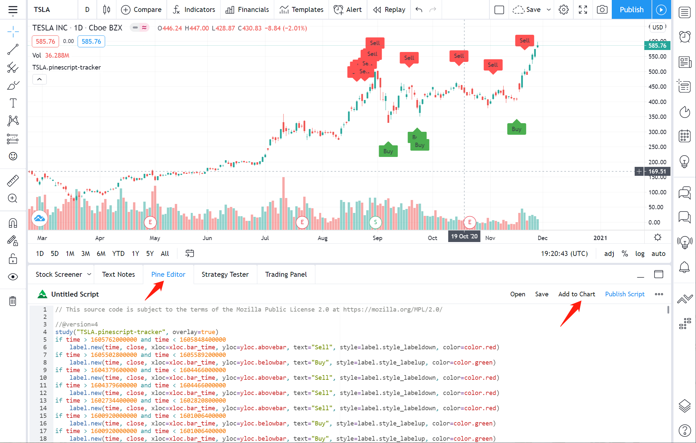

# trace-ark-trades

This project records all purchases and sales made by ARK Invest from 11/12/2019 to the present and utilizes pine script to visualize these trades in TradingView. It includes trade records of 251 stocks. Through analyzing these trades, I think it's a good beginning to explore how ARK invests and builds your own investing system.

## Instructions

I will use Tesla Inc (TSLA) as an example to show how to use this project.

- Access TradingView website
  - Enter https://www.tradingview.com in your browser.

- Type the ticker in the search bar
  
  

- Move to full-featured chart
  
  

- Find the ticker's folder and copy the script from the .pinescript file
  
  

- Paste the script in the Pine Editor section and add to the chart
  
  

## Thank you

I got inspired by a video made by this [Youtuber](https://youtu.be/DfSRNcCbEpA). I follow his idea to finish this project. He did lots of awesome videos to analyze the company's finances and introduce math knowledge behind the stock indicator. If you'd like to learn how to invest, I strongly recommend you to subscribe to his youtube channel.
