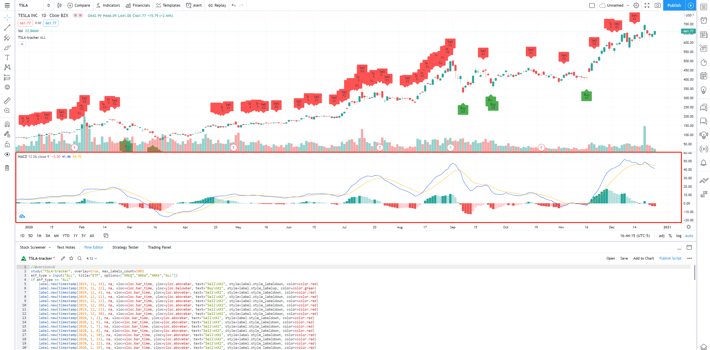

# trace-ark-trades

This project records all purchases and sales made by [ARK Invest](https://ark-invest.com/) from 11/12/2019 to the present and utilizes [Pine script](https://www.tradingview.com/pine-script-docs/en/v4/index.html) to visualize these trades in [TradingView](https://www.tradingview.com). 
It includes trade records of 266 stocks. 
Through analyzing these trades, I think it's an excellent beginning to investigate how ARK invests and build your own investing system. 
BTW, you can combine some charting tools, technical indicators, and my scripts to analyze your stocks in TradingView.

## :rocket: Update (1/28/2021)

1/27/2021
- ARKG: add a new ticker **HIMS**
- ARKK: add a new ticker **BEAM**

1/26/2021
- ARKQ: add a new ticker **PCAR**
- ARKW: add a new ticker **TWTR**

## :star2: New features

- Count how many Ark ETFs sold/bought your stock on the same day 

    
    
    For example, ARKF, ARKG, and ARKQ sold AAPL on 1/8/2021. We mark "×3" on the label of 1/8/2021.
    
- View the trading records of each ETF on your stock

    - Click the **Settings** in indicator legend

        
    
    - Choose an ETF which your stock belong to
    
        
    
    - Observe the Sell/Buy information(share volume) and stock weight in the ETF
    
        

## :page_with_curl: Data sources

I get trade data from 11/12/2019 - 10/16/2020 in this [pdf](https://ark-invest.com/wp-content/trades/ARK_Trades.pdf). 
From 10/19/2020 to the present, the stock's share change is calculated using its day to day position in ARK's holdings. 
You can check ARK's holdings from ARK's [website](https://ark-funds.com/investor-resources).

## :memo: Instructions

I will use Tesla Inc (TSLA) as an example to show how to use this project.

- Access TradingView website
  - Enter https://www.tradingview.com in your browser.

- Type the ticker in the search bar
  
  

- Move to the full-featured chart
  
  

- Find the ticker's folder (Ctrl+F) and copy the script from the .pinescript file
  
  

- Paste the script in the Pine Editor section and add to the chart
  
  
 
## :bulb: Tips

There are some tips to help you to analyze your stocks.

- Use tools provided by TradingView (Using Resistance Line as an example)

    
 
- Add technical indicators (Using MACD as an example)

    
    
    
    
- Add source code of technical indicators to my script (Using Bollinger Bands as an example)

    

    
    
## :link: Other resources

- [Ark track - Alien tomato:tomato:](https://ark.alien-tomato.com/)

- [ARK Invest Active ETF Holdings Tracker](https://www.arktrack.com/)

- [Cheaper Than Guru](https://cheaperthanguru.com/)

## :warning: Disclaimer 

This project is for educational and entertainment purposes only. 
The information herein may be inaccurate or outdated. 
It is your responsibility to verify all information.
Your investments are solely your own responsibility.
It is very important for you to conduct your own research or consult a financial adviser before you make any investment decisions.
The author accepts no responsibility for buying or selling decisions made using the information provided by this repository.
 
## :tomato: Thank you

I got inspired by a video made by this [Youtuber](https://youtu.be/DfSRNcCbEpA). I follow his idea to finish this project. He did lots of awesome videos to analyze the company's finances and introduce math knowledge behind the stock indicator. If you'd like to learn how to invest, I strongly recommend you to subscribe to his youtube channel.
